# 天候を予測して電力需給を合わせるゲーム — デモ版 設計書

- リポジトリ名：`weather-grid-balancer-demo`
- 対象エディション：デモ版（アイデアの視覚化）
- プラットフォーム：ゲーム（Unity WebGL、C#、PlayerPrefs、Unity Play）

---

## 1. 概要

### 1.1 課題

プレイヤーは小さな島の電力司令室の運転員になる。島の電源は太陽光・風力・火力・蓄電池で、需要は時間帯と天候で変わる。太陽光と風力は天候しだいで出力が大きく振れるため、プレイヤーは天気予報（確率で示される）を読み、次の時間帯にどの天候が来るかを予測して、火力の出力・蓄電池の充放電・需要調整をあらかじめ決めておく。時間帯が終わると実際の天候が判明し、供給と需要のずれ（インバランス）が費用と停電になる。予測が当たれば安く安定に、外れれば高くつく。プレイヤーの仕事は発電所を操作することではなく、「不確かな予報からどれだけ備えるか」を決めることである。

### 1.2 デモ版の到達点

来場者が「予報を見る → 次の時間帯の天候を宣言し、電源の計画を決める → 実況が明かされ、需給の差と費用が出る → 4時間帯×5日を通す → 総費用・停電回数・予測的中率・ランクが表示される → 同じシード（同じ天候の系列）で計画を変えて再挑戦する」という一連の体験を、ブラウザ1つ・約5分で完結して行える展示物とする。

### 1.3 ターゲットとプラットフォームの選定理由

- 成果物を直接操作・閲覧するのは来場者（人間）であるため、人間向けプラットフォームから選定する。
- 課題で「ゲーム」が明示されているため、ゲームを選択し、プロジェクト方針どおり Unity WebGL（C#・PlayerPrefs・Unity Play）で構成する。
- プレイヤーの入力（予測宣言・電源計画）に応じて結果が変わる対話的な成果物であり、電子書籍・動画は不適である。
- サーバ・DB・外部通信を一切持たず、ブラウザ内で完結する。

### 1.4 デモ版の適用制約

| 項目 | 適用内容 |
|---|---|
| 実装方式 | 1 issueのワンショット実装 |
| 外部API | 一切使用しない。天候・需要はゲーム内のシード付き乱数で生成し、実在の気象データ・気象APIは用いない |
| 認証 | 持たない |
| セッション | 初回ロード時にブラウザ内で不透明なオーナーIDを生成し、PlayerPrefsの全キーの接頭辞として付与する。他オーナーのデータは参照・操作しない |
| DB | 持たない。PlayerPrefs（ブラウザのローカルストレージ）のみ。毎日JST 03:00を境にページロード時に自動リセット（5.9節） |
| AI機能 | 「おまかせ計画」はルールベースの充当手順である。学習・推論モデル・外部AI APIは使用しない |
| デザイン／測定／保守／監視 | なし（Unity既定のUIとプリミティブ図形で表示） |
| 個人情報 | 一切取得しない |
| Unity構成 | シーン・UI・オブジェクトはすべてコードで動的生成し、Unity EditorのGUI操作を前提としない。ビルドは `Unity.exe -batchmode -nographics -executeMethod` でCLI実行する |

---

## 2. 機能一覧

| ID | 機能 | 概要 |
|---|---|---|
| F1 | ゲーム開始 | 新規シード、または直前のシードで5日間（20時間帯）のゲームを開始する |
| F2 | 予報の閲覧 | 当日各時間帯の日次予報（天候・風の確率分布）、直近時間帯の直前予報、明日の気圧配置の見込みを表示する |
| F3 | 予測宣言 | 次の時間帯の天候（空）と風を1つずつ宣言する。既定は直前予報で最も確率の高い組 |
| F4 | 電源計画 | 火力出力・蓄電池の充放電・需要調整を決める。宣言した天候での計画バランスを即時表示する |
| F5 | 計画検証 | 火力の変化幅・蓄電池の残量・需要調整の残回数を超える入力を補正し、理由を表示する |
| F6 | おまかせ計画 | 宣言した天候で需給が釣り合うよう、ルールに従って電源計画を自動で埋める |
| F7 | 確定と実況 | 計画を確定すると実況天候・実需要が明かされ、需給精算（緊急電源・停電・出力抑制・過剰供給）と費用が表示される |
| F8 | 日次まとめ | 夜の時間帯の精算後に、当日の費用内訳・停電回数・予測的中数を表示する |
| F9 | 最終結果 | 総費用、費用内訳、停電回数、予測的中率、時間帯ごとの予報・宣言・実況の一覧、ランクを表示する |
| F10 | 同じシードで再挑戦 | 直前のゲームと同じ気圧配置・実況・需要の系列でゲームを再開始する |
| F11 | 自動保存と復元 | 時間帯の境界でゲーム状態を保存し、ページ再ロード時にその時間帯の計画前から復元する |
| F12 | 日次リセット | ページロード時にJST 03:00の境界を判定し、越えていれば保存データを消去する |

---

## 3. ゲームの世界と基本要素

### 3.1 時間

- 1日は4つの時間帯（朝・昼・夕・夜）で構成する。1ゲームは5日＝20時間帯。
- 時間帯ごとに「計画 → 確定 → 実況・精算」を1回ずつ行う。実時間のタイマーは持たず、プレイヤーの確定操作で進む。
- 電力量の単位はすべて「時間帯あたりの平均出力（MW）」で扱い、時間帯内の変動は扱わない。

### 3.2 天候

天候は「空」と「風」の2つの要素の組で表す。

| 空 | 太陽光係数 | 需要への加算 |
|---|---|---|
| 晴れ | 1.0 | +10 |
| 曇り | 0.4 | 0 |
| 雨 | 0.1 | −5 |

| 風 | 風力係数 | 説明 |
|---|---|---|
| 弱風 | 0.1 | ほとんど回らない |
| 中風 | 0.5 | 標準的な出力 |
| 強風 | 1.0 | 定格出力 |
| 暴風 | 0.0 | 安全のため風車が停止する（カットアウト） |

- 暴風は「風が強いほど発電する」という直感が裏切られる要素であり、前線・台風の日にのみ出現する。

### 3.3 気圧配置（日のタイプ）

各日は4つの気圧配置のいずれかを持つ。気圧配置が時間帯ごとの日次予報（確率分布）を決める。

| 気圧配置 | 出現割合 | 特徴 |
|---|---|---|
| 高気圧 | 40% | 晴れが多く風は弱い。太陽光が主力になる |
| 移行 | 30% | 空も風も割れる。最も読みにくい |
| 前線通過 | 20% | 雨と強風が多く、まれに暴風 |
| 台風接近 | 10% | 雨と暴風が多い。風力は止まり太陽光も出ない |

- 1日目は必ず高気圧とし、来場者が操作を覚える余地を作る。
- 2日目以降は系列Wから出現割合に従って決める。
- 明日の気圧配置は当日中に確定値として表示する（「明日は前線通過の見込み」）。

### 3.4 日次予報の分布表

気圧配置と時間帯の組ごとに、空と風の確率分布を固定の表で定義する。この表がそのまま日次予報として表示され、実況もこの分布から抽選する（予報は誇張も過小もしない）。

空の分布（晴れ／曇り／雨、%）

| 気圧配置 | 朝 | 昼 | 夕 | 夜 |
|---|---|---|---|---|
| 高気圧 | 70／30／0 | 80／20／0 | 60／40／0 | 50／50／0 |
| 移行 | 30／50／20 | 40／40／20 | 20／50／30 | 20／50／30 |
| 前線通過 | 10／40／50 | 0／30／70 | 10／40／50 | 20／50／30 |
| 台風接近 | 0／30／70 | 0／20／80 | 0／30／70 | 10／40／50 |

風の分布（弱風／中風／強風／暴風、%）

| 気圧配置 | 朝 | 昼 | 夕 | 夜 |
|---|---|---|---|---|
| 高気圧 | 60／40／0／0 | 50／40／10／0 | 50／50／0／0 | 70／30／0／0 |
| 移行 | 30／50／20／0 | 20／50／30／0 | 20／50／30／0 | 30／50／20／0 |
| 前線通過 | 10／40／40／10 | 10／30／50／10 | 10／40／40／10 | 20／50／30／0 |
| 台風接近 | 0／20／40／40 | 0／10／30／60 | 0／20／40／40 | 10／30／40／20 |

- 空と風は独立に抽選する（系列Wを空用と風用に分ける）。

### 3.5 直前予報

- 次の時間帯の予報は、日次予報より実況に近い「直前予報」に更新して表示する。
- 直前予報は「日次予報の分布」と「実況に全確率を置いた分布」を1：1で混ぜ、各値を10%単位に丸めて合計100%に揃えたものとする（丸めは最大剰余法）。
- これにより直前予報では実況の天候が必ず50%以上で示されるが、確定はしない。残りの確率が「備えるべき外れ」を表す。
- 直前予報は次の時間帯についてのみ表示し、それ以降の時間帯は日次予報のまま表示する。火力の変化幅の制限（3.7節）があるため、ぼやけた日次予報の段階から備えを始める必要が生まれる。

### 3.6 需要

- 時間帯ごとの基準需要は、朝100・昼120・夕140・夜110（MW）。
- 実需要 ＝ 基準需要 ＋ 実況の空による加算（3.2節） ＋ 需要のぶれ。
- 需要のぶれは系列Dから −5〜+5 の整数を時間帯ごとに抽選する。
- 画面には「需要見込み ＝ 基準需要 ＋ 宣言した空による加算」を表示し、ぶれは表示しない。

### 3.7 電源

| 電源 | 容量 | プレイヤーの入力 | 費用 | 制約 |
|---|---|---|---|---|
| 太陽光 | 80 MW | なし（天候で決まる） | 0 | 出力 ＝ 80 × 時間帯係数（朝0.5／昼1.0／夕0.6／夜0.0）× 空の係数。小数は四捨五入 |
| 風力 | 60 MW | なし（天候で決まる） | 0 | 出力 ＝ 60 × 風の係数 |
| 火力 | 100 MW | 出力を0〜100、10刻みで指定 | 3／MW | 直前の時間帯の出力から ±40 以内でしか変えられない（変化幅制限）。ゲーム開始時の「直前の出力」は40 |
| 蓄電池 | 容量60 MWh | 充電 10／20／30、放電 10／20／30、または0 | 0 | 充電は需要に加算し、蓄えられる量は充電量の90%。放電は供給に加算する。放電は残量以下、充電は空き容量÷0.9以下（10刻みに切り下げ）に限る。開始残量30 |
| 需要調整 | 20 MW | 削減量を 0／10／20 で指定 | 4／MW | 1ゲームで5回まで使える（0以外を指定した時間帯が1回） |

- 供給 ＝ 太陽光 ＋ 風力 ＋ 火力 ＋ 放電。需要側 ＝ 実需要 ＋ 充電 − 需要調整。
- インバランス ＝ 供給 − 需要側。

### 3.8 需給精算

インバランスは以下の順で処理し、費用と停電回数に変える。

| 段階 | 条件 | 処理 | 費用 |
|---|---|---|---|
| 許容幅 | インバランスの絶対値が5以下 | 系統の余裕で吸収する | 0 |
| 緊急電源 | 不足（−5未満）のうち、許容幅を除いた最初の30 MWまで | 緊急ディーゼル発電で補う | 10／MW |
| 停電 | 不足が緊急電源でも足りない分 | 停電となる。停電回数を1増やす | 30／MW |
| 出力抑制 | 余剰（+5超）のうち、許容幅を除いた分で太陽光＋風力の実出力までの量 | 再生可能電源の出力を捨てる | 1／MW |
| 過剰供給 | 余剰が出力抑制でも消せない分（火力・放電の出し過ぎ） | 系統が不安定になる | 5／MW |

- 許容幅の5 MWは、不足側・余剰側ともに費用計算の対象から除く（例：不足12 → 緊急電源7 MW）。
- 停電が1 MWでも発生した時間帯は停電回数1とし、量では数えない。

### 3.9 予測宣言と的中

- プレイヤーは確定前に、次の時間帯の空と風を1つずつ宣言する。既定値は直前予報で最も確率の高い空と風（同率なら表の並び順で先のもの）。
- 空と風の両方が実況と一致したときのみ「的中」とする。
- 的中率 ＝ 的中した時間帯数 ÷ 20。
- 宣言は電源計画の計算に使う天候を決めるだけであり、宣言自体に費用や罰則はない。

### 3.10 費用とランク

- スコアは総費用（小さいほど良い）。費用の内訳は火力・需要調整・緊急電源・停電・出力抑制・過剰供給の6種。
- ランクは総費用と停電回数で決める。

| ランク | 条件 |
|---|---|
| S | 総費用 3,500 以下 かつ 停電 0 回 |
| A | 総費用 4,500 以下 かつ 停電 1 回以下 |
| B | 総費用 6,000 以下 |
| C | 上記以外 |

- ランクの境界はゲームバランス上の定数であり、5.11節の定数表で管理する。

---

## 4. 画面と操作

### 4.1 司令室画面（メイン）

| 領域 | 内容 |
|---|---|
| 上部 | 日／時間帯、累計費用、停電回数、需要調整の残回数、蓄電池残量ゲージ |
| 予報パネル | 当日4時間帯の日次予報（空・風の確率を棒で表示）。次の時間帯のみ直前予報に置き換え「直前」と表示。明日の気圧配置 |
| 宣言パネル | 空（晴れ／曇り／雨）と風（弱／中／強／暴）のボタン。選択中の組を強調 |
| 計画パネル | 火力スライダー（10刻み、変更可能な範囲を強調表示）、蓄電池（充電30／20／10／0／放電10／20／30）、需要調整（0／10／20）、「おまかせ計画」ボタン |
| バランス表示 | 宣言した天候での供給内訳（太陽光・風力・火力・放電）と需要側（需要見込み・充電・需要調整）を左右に積んだ棒で表示し、差をMWで示す。許容幅内なら「釣り合い」と表示 |
| 下部 | 「確定」ボタン。計画検証で補正があった場合はその理由を確定の前に表示 |

### 4.2 実況・精算画面

- 実況の空と風、宣言との一致（的中／外れ）、実需要。
- 計画時の供給内訳と実況での供給内訳を並べて表示し、差を強調する。
- インバランスと精算結果（緊急電源・停電・出力抑制・過剰供給のMWと費用）、当時間帯の合計費用。
- 「次へ」で次の時間帯へ進む。夜の時間帯の後は日次まとめへ進む。

### 4.3 日次まとめ画面

- 当日の費用内訳、停電回数、的中数（4時間帯中）、蓄電池残量、明日の気圧配置。
- 「次の日へ」で翌日の朝へ進む。5日目の後は最終結果へ進む。

### 4.4 最終結果画面

- 総費用、ランク、費用内訳（6種）、停電回数、的中率。
- 20時間帯の一覧（気圧配置・直前予報の最有力・宣言・実況・インバランス・費用）。
- ベストスコア（最小総費用）とシード値。
- 「同じシードで再挑戦」「タイトルへ」。

### 4.5 タイトル画面

- 新規開始／同じシードで再挑戦（直前シードがあるとき）／続きから（進行中データがあるとき）。
- ベストスコアとそのランク、直前シード値を表示。

---

## 5. ロジック仕様

すべてルールベースで、外部との通信を持たない。数値定数は5.11節にまとめる。

### 5.1 関数A：ゲーム初期化（initGame）

**入力**：シード（新規の場合は現在時刻から生成、再挑戦の場合は直前のシード）。

**出力**：ゲーム状態（日＝1、時間帯＝朝、累計費用0、停電回数0、需要調整の残回数5、蓄電池残量30、直前の火力出力40、気圧配置5日分、実況20時間帯分、直前予報20時間帯分、需要のぶれ20時間帯分、集計値）。

**手順**

1. シードから3つの独立した乱数系列を作る。系列W（気圧配置・空・風）、系列D（需要のぶれ）、系列R（予備。デモ版では未使用だが、系列の並びを固定するために確保する）。系列を分けることで、プレイヤーの操作順が天候・需要の結果に影響しない。
2. 1日目の気圧配置を高気圧に固定し、2〜5日目を系列Wから出現割合（3.3節）に従って抽選する。
3. 20時間帯すべてについて、関数Bで日次予報・実況・直前予報を生成する。生成は日1朝から日5夜の順に行い、系列Wの消費順を固定する。
4. 20時間帯すべてについて、系列Dから需要のぶれを抽選する。
5. 蓄電池残量を30、直前の火力出力を40、需要調整の残回数を5にする。
6. ゲーム状態を「計画中（日1・朝）」とする。

### 5.2 関数B：予報生成（buildForecast）

**入力**：気圧配置、時間帯、系列W。

**出力**：日次予報（空の分布・風の分布）、実況（空・風）、直前予報（空の分布・風の分布）。

**手順**

1. 3.4節の表から、気圧配置と時間帯に対応する空の分布と風の分布を取り出し、日次予報とする。
2. 系列Wから空を1回、風を1回、それぞれ日次予報の分布に従って抽選し、実況とする。確率0の要素は抽選されない。
3. 直前予報を作る。各要素について「日次予報の確率 × 0.5 ＋（実況と一致する要素なら 50、そうでなければ 0）」を計算する。
4. 手順3の値を10%単位に丸める。まず各値を10で割って切り捨て、合計が100に足りない分を、小数部の大きい要素から順に10ずつ加える（最大剰余法）。同じ小数部の場合は表の並び順で先の要素に加える。
5. 丸めた分布を直前予報とする。この手順により、実況の要素は必ず50%以上になり、日次予報で0%だった要素は0%のままである。

### 5.3 関数C：計画検証（validatePlan）

**入力**：プレイヤーが入力した計画（火力出力・蓄電池の充放電・需要調整）、ゲーム状態（直前の火力出力・蓄電池残量・需要調整の残回数）。

**出力**：補正済みの計画と、補正理由の一覧。

**手順**

1. 火力出力を0〜100に収め、10刻みに丸める。さらに「直前の火力出力 −40」〜「直前の火力出力 ＋40」の範囲に収める。範囲外なら最も近い境界に置き換え、「火力は1時間帯に±40までしか変えられません」を理由に加える。
2. 蓄電池が放電の場合、放電量が残量を超えていれば、残量以下で最大の10刻みの値に置き換える（残量が10未満なら0）。理由「蓄電池の残量が足りません」を加える。
3. 蓄電池が充電の場合、充電量 × 0.9 が空き容量（60 − 残量）を超えていれば、空き容量 ÷ 0.9 以下で最大の10刻みの値に置き換える（該当なしなら0）。理由「蓄電池が満充電に近いため充電量を減らしました」を加える。
4. 需要調整が0以外で残回数が0なら、0に置き換え、理由「需要調整の残回数がありません」を加える。
5. 補正済みの計画を返す。補正がなければ理由は空。
6. 画面上では、スライダーやボタンの選べる範囲を手順1〜4の制約であらかじめ絞り、検証は確定時の最終防衛として働く。

### 5.4 関数D：計画バランス計算（projectBalance）

**入力**：宣言した空・風、時間帯、補正済みの計画。

**出力**：計画上の供給内訳、需要側内訳、計画インバランス。

**手順**

1. 太陽光見込み ＝ 80 × 時間帯係数 × 宣言した空の係数（四捨五入）。
2. 風力見込み ＝ 60 × 宣言した風の係数（四捨五入）。
3. 需要見込み ＝ 基準需要 ＋ 宣言した空の加算。
4. 供給 ＝ 太陽光見込み ＋ 風力見込み ＋ 火力 ＋ 放電。需要側 ＝ 需要見込み ＋ 充電 − 需要調整。
5. 計画インバランス ＝ 供給 − 需要側。絶対値が5以下なら「釣り合い」と表示する。

### 5.5 関数E：おまかせ計画（autoPlan）

宣言した天候で計画インバランスが許容幅に収まるよう、費用の安い順に電源を充てる。実況が宣言と異なれば外れるため、これは「予報どおりなら釣り合う計画」を作る補助である。

**入力**：宣言した空・風、時間帯、ゲーム状態（直前の火力出力・蓄電池残量・需要調整の残回数）。

**出力**：計画（火力出力・蓄電池の充放電・需要調整）。

**手順**

1. 火力0・蓄電池0・需要調整0の状態で関数Dにより不足量 ＝ 需要見込み − 太陽光見込み − 風力見込み を求める。
2. 不足量が5を超える場合（供給を増やす）
   1. 火力の選べる範囲（直前の出力±40、0〜100）の中で、不足量以上となる最小の10刻みの値を選ぶ。範囲の上限でも不足なら上限を選ぶ。
   2. まだ不足が5を超えていれば、放電を不足以上となる最小の10刻み（最大30、残量以下）で充てる。
   3. まだ不足が5を超えていれば、需要調整の残回数が1以上のとき、不足以上となる最小の値（10または20）を充てる。
   4. それでも不足が残る場合はそのまま返す（緊急電源・停電の可能性を画面のバランス表示が示す）。
3. 不足量が −5 未満の場合（供給が余る）
   1. 火力を選べる範囲の下限にする。再計算して余剰が消えれば終了。
   2. 余剰が残れば、充電を余剰以下で最大の10刻み（最大30、空き容量の制約内）にする。
   3. それでも余剰が残る場合はそのまま返す（出力抑制は費用が小さいため、火力を下限まで下げたうえでの余剰は許容する）。
4. 不足量が −5〜5 の場合は火力を選べる範囲内で不足量に最も近い値にし、蓄電池・需要調整は0とする。
5. 得られた計画を関数Cに通してから返す。

- 火力を放電より先に充てるのは、放電が残量を消費して次の時間帯の備えを削るためであり、蓄電池は「火力の変化幅で追いつけない分」を埋める役割に位置づける。

### 5.6 関数F：需給精算（settleSlot）

確定操作の後に実行する。

**入力**：補正済みの計画、当時間帯の実況（空・風）、需要のぶれ、時間帯、宣言した空・風。

**出力**：実況の供給内訳、実需要、インバランス、精算内訳（緊急電源・停電・出力抑制・過剰供給のMWと費用）、当時間帯の費用、的中の有無、更新後のゲーム状態。

**手順**

1. 太陽光 ＝ 80 × 時間帯係数 × 実況の空の係数（四捨五入）。風力 ＝ 60 × 実況の風の係数（四捨五入）。
2. 実需要 ＝ 基準需要 ＋ 実況の空の加算 ＋ 需要のぶれ。
3. 供給 ＝ 太陽光 ＋ 風力 ＋ 火力 ＋ 放電。需要側 ＝ 実需要 ＋ 充電 − 需要調整。インバランス ＝ 供給 − 需要側。
4. インバランスの絶対値が5以下なら、精算内訳はすべて0。
5. インバランスが −5 未満なら、不足 ＝ −インバランス − 5 とする。緊急電源 ＝ 不足と30の小さい方。停電 ＝ 不足 − 緊急電源。停電が1以上なら停電回数を1増やす。
6. インバランスが 5 を超えるなら、余剰 ＝ インバランス − 5 とする。出力抑制 ＝ 余剰と（太陽光 ＋ 風力）の小さい方。過剰供給 ＝ 余剰 − 出力抑制。
7. 当時間帯の費用 ＝ 火力 × 3 ＋ 需要調整 × 4 ＋ 緊急電源 × 10 ＋ 停電 × 30 ＋ 出力抑制 × 1 ＋ 過剰供給 × 5。費用内訳（6種）と累計費用に加える。
8. 蓄電池残量を更新する。放電なら残量 − 放電量。充電なら残量 ＋ 充電量 × 0.9（小数は切り捨て）。残量は0〜60に収まる（関数Cで保証される）。
9. 需要調整が0以外なら残回数を1減らす。
10. 直前の火力出力を当時間帯の火力出力に更新する。
11. 宣言した空と風が実況と両方一致すれば的中数を1増やす。
12. 時間帯の記録（気圧配置・日次予報・直前予報・宣言・実況・計画・精算内訳・費用）を集計値に追加する。
13. ゲーム状態を「精算表示中」とする。

- 出力抑制が「太陽光＋風力の実出力」を上限とするのは、捨てられるのは実際に発電した再生可能電源の分だけであり、火力・放電の出し過ぎは抑制で消せないという区別を表すためである。夜（太陽光0）に風も弱ければ、余剰はほぼ過剰供給になる。

### 5.7 関数G：進行（advance）

精算表示の「次へ」操作で実行する。

1. 時間帯が朝・昼・夕なら、時間帯を1つ進め、次の時間帯の直前予報を表示対象にして「計画中」に戻る。関数Iで保存する。
2. 時間帯が夜なら、当日の費用内訳・停電回数・的中数・蓄電池残量・明日の気圧配置をまとめて「日次まとめ表示中」とする。
3. 日次まとめの「次の日へ」操作で、日が5未満なら日を1進め、時間帯を朝にして「計画中」に戻る。関数Iで保存する。
4. 日が5なら関数Hへ進む。

### 5.8 関数H：最終精算（finalizeGame）

1. 総費用（累計費用）をスコアとする。
2. ランクを3.10節の表で判定する。上から順に条件を満たした最初のランクとする。
3. 的中率 ＝ 的中数 ÷ 20 を百分率（整数）で表す。
4. 20時間帯の記録一覧を作る。
5. ベストスコアが未設定、または総費用がベストスコアより小さければ、ベストスコアとそのランクを更新する。
6. シードを「直前のシード」として保存し、「同じシードで再挑戦」を選べるようにする。
7. ゲーム状態を「最終結果表示中」とし、進行中の保存データを削除する。

### 5.9 関数I：保存と日次リセット（persist / resetIfNeeded）

**リセット判定（ページロード時）**

1. PlayerPrefsからオーナーIDを読む。なければ生成して保存する。
2. 「前回リセット日時」を読む。現在時刻（JST）に対し直近のJST 03:00より前であれば、オーナーID以外の全キーを削除し、前回リセット日時を現在時刻で更新する。
3. 削除後はタイトル画面を表示する。

**保存**

- 関数Gの手順1・3で、ゲーム状態（シード・日・時間帯・累計費用・費用内訳・停電回数・的中数・蓄電池残量・直前の火力出力・需要調整の残回数・気圧配置・実況・直前予報・需要のぶれ・時間帯の記録）を1つのJSON文字列としてPlayerPrefsに保存する。
- 最終精算時にもベストスコア・直前シードを保存する。
- 保存キーはすべてオーナーIDを接頭辞に持つ。

**復元**

- ページロード時、リセット判定を通過したのち、進行中のゲームがあれば「続きから」を選べる。復元は保存時点（その時間帯の計画前）から始まる。計画入力中・精算表示中の状態は保存しないため、確定済みで未保存の精算はページ再ロードで生じない（確定と精算と保存を同一操作内で連続して行う）。

### 5.10 関数J：計画入力の即時反映（onPlanChanged）

計画パネルの操作ごとに実行する。

1. 入力値を関数Cに通す（補正理由があればその場で表示する）。
2. 補正済みの計画と宣言した天候で関数Dを実行し、バランス表示を更新する。
3. 宣言パネルの操作でも同じ手順を実行し、宣言だけを変えたときにバランスがどう動くかを見せる。

### 5.11 定数一覧（デモ版の既定値）

| 定数 | 値 | 用途 |
|---|---|---|
| 日数／1日の時間帯数 | 5／4 | 関数A・G |
| 基準需要（朝・昼・夕・夜） | 100・120・140・110 | 関数D・F |
| 空による需要加算（晴・曇・雨） | +10・0・−5 | 関数D・F |
| 需要のぶれ | −5〜+5 の整数 | 関数A・F |
| 太陽光容量 | 80 | 関数D・F |
| 太陽光の時間帯係数（朝・昼・夕・夜） | 0.5・1.0・0.6・0.0 | 関数D・F |
| 空の太陽光係数（晴・曇・雨） | 1.0・0.4・0.1 | 関数D・F |
| 風力容量 | 60 | 関数D・F |
| 風の風力係数（弱・中・強・暴） | 0.1・0.5・1.0・0.0 | 関数D・F |
| 火力の範囲／刻み | 0〜100／10 | 関数C・E |
| 火力の変化幅 | ±40／時間帯 | 関数C・E |
| 火力の初期「直前の出力」 | 40 | 関数A |
| 火力の費用 | 3／MW | 関数F |
| 蓄電池容量／開始残量 | 60／30 | 関数A・C |
| 充放電の刻み／上限 | 10／30 | 関数C・E |
| 充電効率 | 90% | 関数C・F |
| 需要調整の刻み／上限／回数 | 10／20／5回 | 関数C・E・F |
| 需要調整の費用 | 4／MW | 関数F |
| 許容幅 | ±5 | 関数D・E・F |
| 緊急電源の上限／費用 | 30／10／MW | 関数F |
| 停電の費用 | 30／MW | 関数F |
| 出力抑制の費用 | 1／MW | 関数F |
| 過剰供給の費用 | 5／MW | 関数F |
| 気圧配置の出現割合（高・移・前・台） | 40・30・20・10% | 関数A |
| 直前予報の混合比 | 日次予報 0.5：実況 0.5 | 関数B |
| 予報の表示刻み | 10% | 関数B |
| ランク境界 | S 3,500・A 4,500・B 6,000 | 関数H |

---

## 6. データ仕様

- DBは持たず、PlayerPrefsに以下のキーを保存する。キーはすべて「オーナーID:」を接頭辞に持つ。
- 構造を持つ値はJSON文字列として1キーに保存する。
- 個人を特定できる項目は持たない。

| キー | 型 | 内容 |
|---|---|---|
| owner_id | 文字列 | 不透明なオーナーID（接頭辞なしで保存する唯一のキー） |
| last_reset_at | 文字列 | 前回リセット日時（ISO 8601、JST） |
| game | JSON | 進行中のゲーム状態（下表） |
| last_seed | 整数 | 直前のゲームのシード |
| best_score | 整数 | ベストスコア（最小総費用） |
| best_rank | 文字列 | ベストスコアのランク |

ゲーム状態（game）の構成

| 要素 | 主な項目 |
|---|---|
| Game | シード、日、時間帯、状態（計画中／精算表示中／日次まとめ表示中／最終結果表示中）、累計費用、停電回数、的中数、開始日時 |
| CostBreakdown | 火力、需要調整、緊急電源、停電、出力抑制、過剰供給 |
| Grid | 蓄電池残量、直前の火力出力、需要調整の残回数 |
| DayPattern（5件） | 日、気圧配置 |
| SlotForecast（20件） | 日、時間帯、日次予報（空3値・風4値）、直前予報（空3値・風4値）、実況の空、実況の風、需要のぶれ |
| SlotRecord（0〜20件） | 日、時間帯、宣言の空・風、計画（火力・充放電・需要調整）、実況の供給内訳、実需要、インバランス、精算内訳、費用、的中 |

---

## 7. ER図

DBは存在しないため、PlayerPrefsに保存するJSONの論理構造を示す。

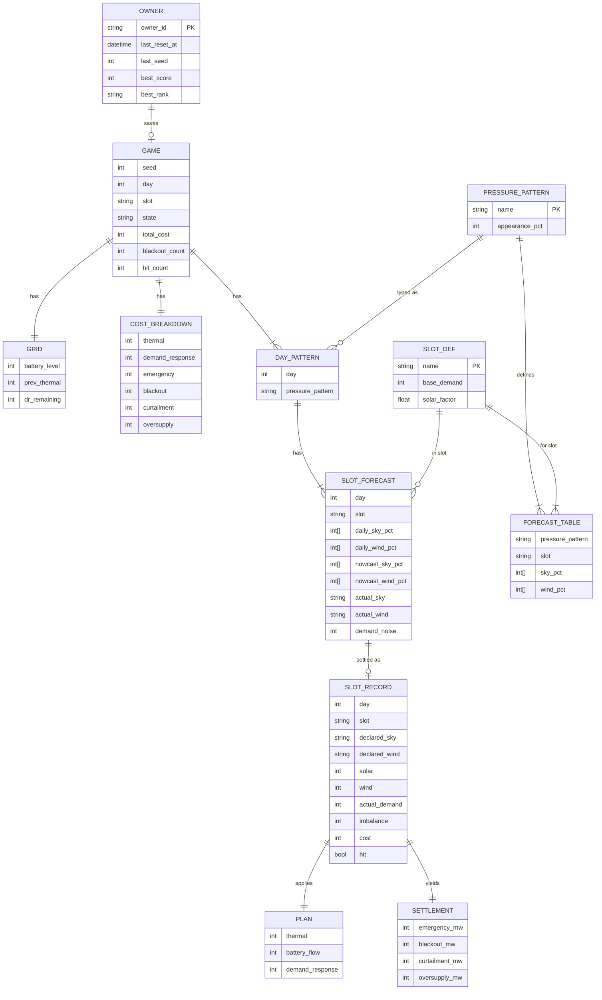

---

## 8. DFD

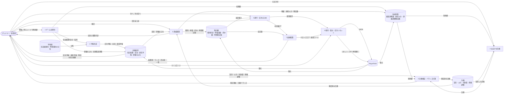

---

## 9. シーケンス図

### 9.1 1時間帯の処理（計画から精算まで）

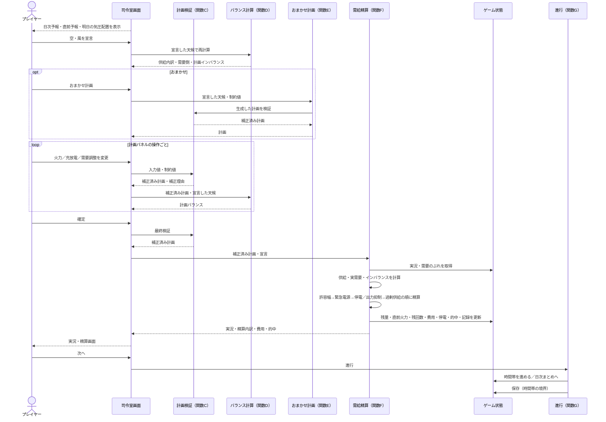

### 9.2 日次まとめと最終精算

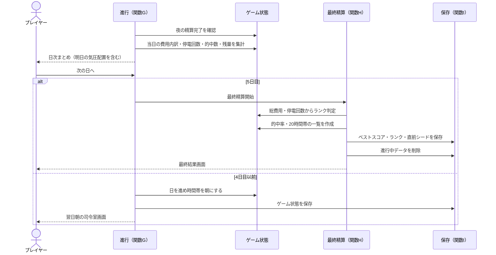

### 9.3 ページロード時の復元と日次リセット

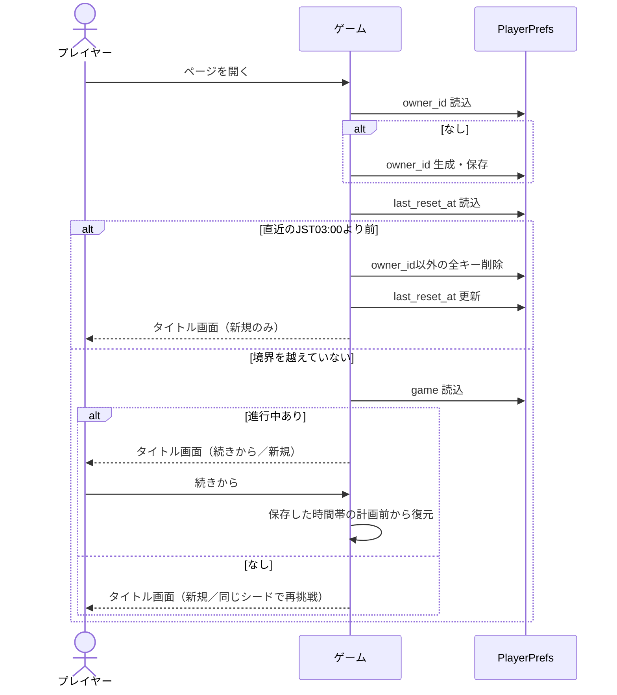

---

## 10. クラス図

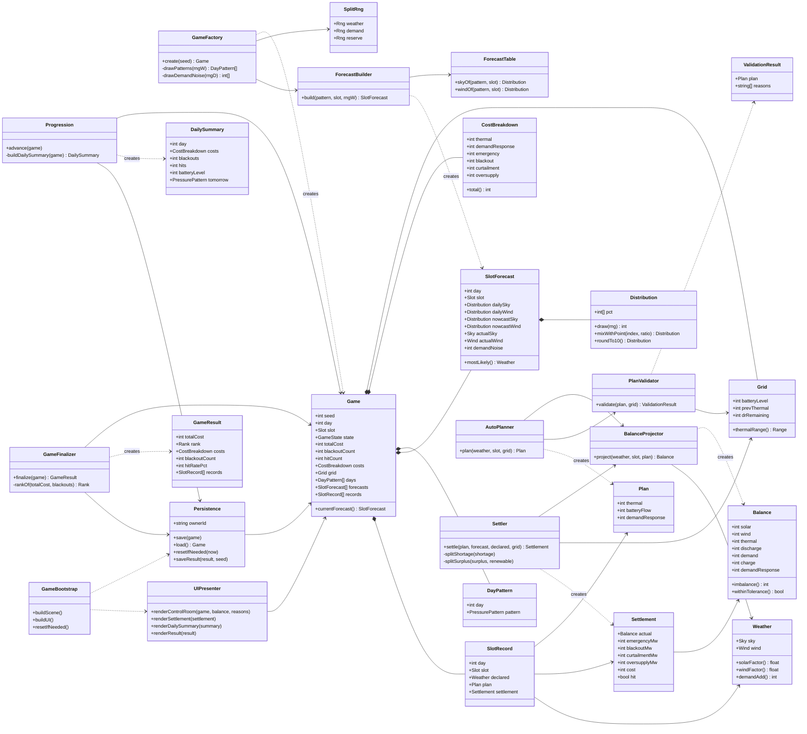

---

## 11. 状態遷移図

### 11.1 ゲーム全体

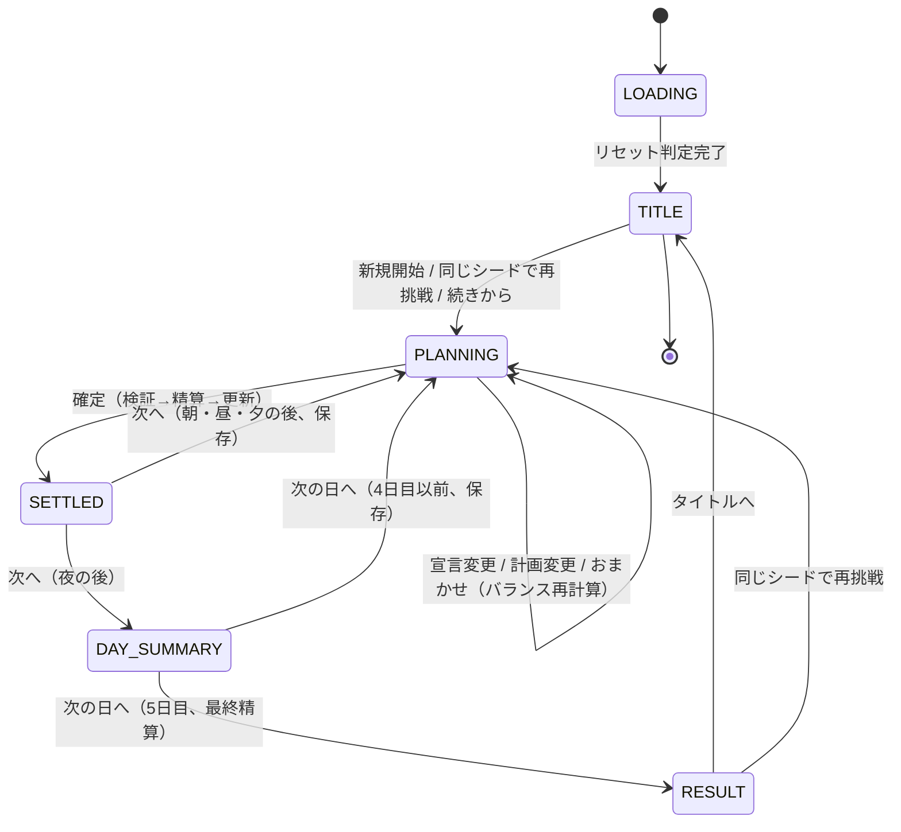

補足規則

- PLANNINGでは、確定するまで何度でも宣言・計画を変えられる。確定は取り消せない。
- 保存はPLANNINGに入る直前（時間帯の境界）にのみ行う。SETTLEDとDAY_SUMMARYは保存せず、ページ再ロード時は直近のPLANNINGの入口から復元する。
- 同じシードで再挑戦した場合、気圧配置・実況・直前予報・需要のぶれは前回と同一になり、宣言と計画だけが結果の違いになる。

### 11.2 時間帯（1コマ）

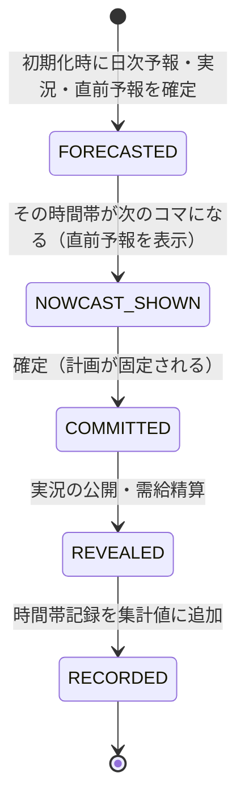

補足規則

- 実況はFORECASTEDの時点で内部的に確定しているが、REVEALEDまで画面に出ない。直前予報は実況を含む混合分布であるため、表示は「実況を50%以上含む分布」として現れる。
- COMMITTED以降、計画は変更できない。

### 11.3 蓄電池

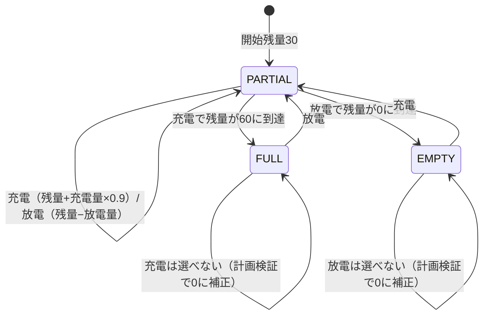

### 11.4 火力

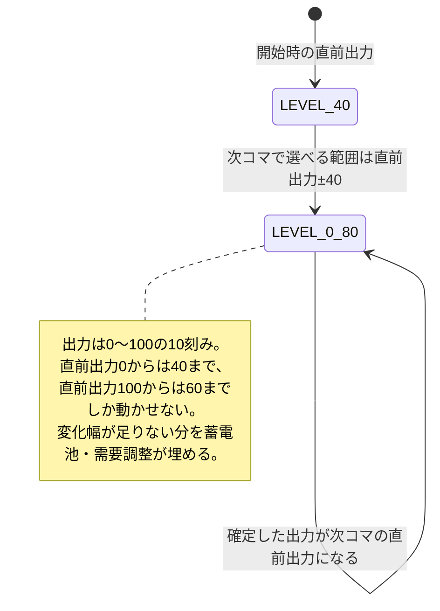

---

## 12. ユースケース図

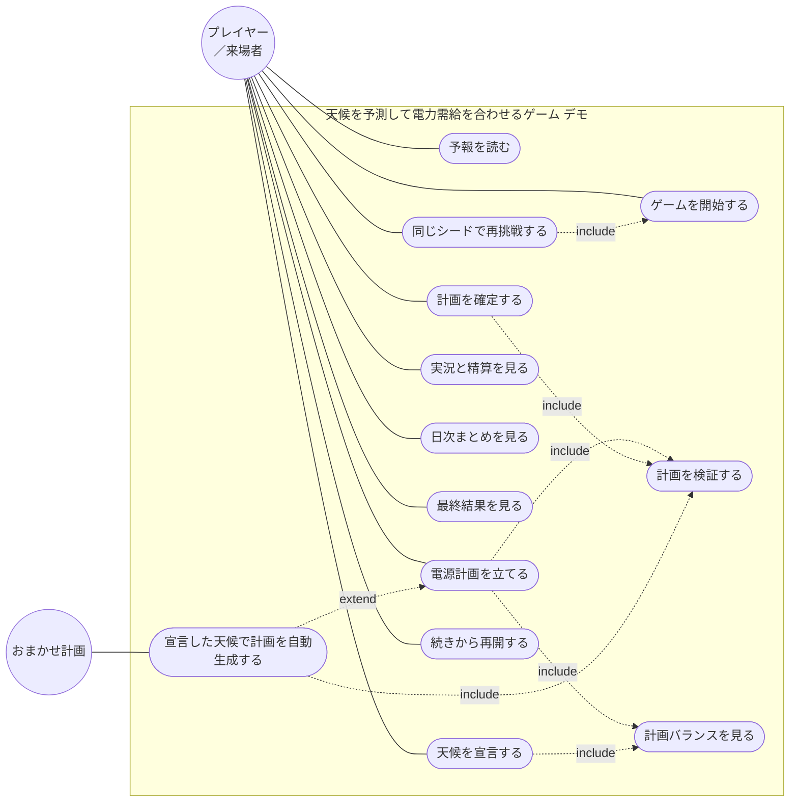

---

## 13. 非機能要件と制約

### 13.1 ロジックの設計原則

- 実況・直前予報・需要のぶれは初期化時に20時間帯分をまとめて確定し、プレイ中に乱数を消費しない。これにより同一シードは同一の系列を再現し、プレイヤーの操作順が天候に影響しない。
- 日次予報の分布表がそのまま抽選の分布であり、予報が実況の分布を誇張・過小にしない。直前予報は日次予報より実況に近い分布として定義し、確率0の要素を0のまま保つ。
- 火力の変化幅制限と蓄電池の残量制約により、「次のコマの直前予報だけを見て火力を合わせる」だけでは追いつかない場面を作り、日次予報の段階から備える動機を与える。
- 計画の制約違反は入力UIの範囲制限で先に防ぎ、確定時の検証を最終防衛とする。補正は必ず理由を表示し、黙って値を変えない。
- 精算は「許容幅 → 緊急電源 → 停電」「許容幅 → 出力抑制 → 過剰供給」の固定順で行い、出力抑制の上限を再生可能電源の実出力とする。
- 確定・精算・状態更新は1操作内で連続して行い、途中の状態を保存しない。保存は時間帯の境界のみとする。
- おまかせ計画は火力 → 放電 → 需要調整の順に充て、余剰時は火力の下限 → 充電の順に減らす。生成した計画は必ず計画検証を通す。

### 13.2 ゲームとしての設計原則

- 予報を確率で示し、「最有力に賭ける」か「外れに備えて余裕を持つ」かの選択が費用の差になることを、実況・精算画面で計画と実況の供給内訳を並べて見せる。
- 暴風のカットアウトと夜の太陽光ゼロにより、「風が強い＝発電が多い」「晴れ＝安心」という直感が外れる場面を必ず含める。
- 1日目を高気圧に固定し、操作を覚える余地を作る。以降は気圧配置の違いで読みにくさが変わる。
- 同じシードでの再挑戦を用意し、宣言と計画の違いだけが結果の違いになる比較を可能にする。
- おまかせ計画だけで5日間を完走できる難易度とし、計画を自分で立てない来場者にも成立する。
- 色のみで意味を区別せず、空・風・電源は記号と文字を併記する（例：晴「☀」曇「☁」雨「☂」、弱「▁」中「▃」強「▇」暴「✕」）。

### 13.3 Unity実装の原則

- シーン・UI・棒グラフ・ゲージはすべて起動時にコードで生成する。Prefab・シーンファイルの手作業編集を前提としない。
- 表示はuGUIの既定フォントとImage（矩形）のみを用い、外部アセットを使わない。
- データ保存はPlayerPrefsのみ。WebGLではブラウザのIndexedDBに保存されるため、書き込み後に明示的に保存を確定する。
- ビルドは `Unity.exe -batchmode -nographics -executeMethod BuildScript.BuildWebGL` でCLI実行する。
- Unity Playへのアップロードのみ人間が手動で行う。
- 外部通信（Unity Analytics・広告・ランキング・気象API）を一切含めない。

### 13.4 日次リセット

- ページロード時に「前回リセット日時」を確認し、直近のJST 03:00より前であればオーナーID以外の全キーを削除する。
- プレイ中に日付境界を越えてもプレイは中断せず、次のページロード時にリセットする。

### 13.5 リポジトリ構成

```
weather-grid-balancer-demo/
├── Assets/
│   ├── Scripts/
│   │   ├── Core/          # Game・Grid・Plan・Weather・SlotForecast・Distribution・SlotRecord
│   │   ├── Logic/         # ForecastBuilder・PlanValidator・BalanceProjector・AutoPlanner・Settler・Progression・GameFinalizer
│   │   ├── Data/          # ForecastTable・定数
│   │   ├── Infra/         # Persistence・SplitRng
│   │   ├── UI/            # UIPresenter・各画面の動的生成
│   │   └── Bootstrap/     # GameBootstrap（シーン・UI生成）
│   └── Editor/
│       └── BuildScript.cs # CLIビルド用
├── ProjectSettings/
├── docs/
│   └── spec.md            # 本書
└── README.md
```

---

## 14. 用語

| 用語 | 定義 |
|---|---|
| 時間帯（コマ） | 朝・昼・夕・夜の4区分。計画・確定・精算を1回ずつ行う最小単位 |
| 気圧配置 | 日ごとのタイプ（高気圧・移行・前線通過・台風接近）。時間帯ごとの予報分布を決める |
| 日次予報 | 気圧配置と時間帯から表で決まる空・風の確率分布。実況はこの分布から抽選される |
| 直前予報 | 次の時間帯についてのみ表示する、日次予報と実況を1：1で混ぜた分布 |
| 実況 | その時間帯の実際の空と風。確定後に公開される |
| 宣言 | プレイヤーが選ぶ、次の時間帯の空と風の予測。計画バランスの計算に使う |
| 計画 | 火力出力・蓄電池の充放電・需要調整の3つの入力 |
| 計画バランス | 宣言した天候での供給と需要側の差 |
| インバランス | 実況での供給 − 需要側。正が余剰、負が不足 |
| 許容幅 | 費用なしで吸収できるインバランスの範囲（±5 MW） |
| 緊急電源 | 不足を高い費用で補う予備電源（最大30 MW） |
| 停電 | 緊急電源でも補えない不足。回数で数える |
| 出力抑制 | 余剰を消すために再生可能電源の出力を捨てること |
| 過剰供給 | 再生可能電源を全部捨てても残る余剰（火力・放電の出し過ぎ） |
| 変化幅制限 | 火力出力を1時間帯に±40までしか変えられない制約 |
| 需要調整 | 需要側を削減する手段。1ゲーム5回まで |
| カットアウト | 暴風時に風車が安全のため停止し出力0になること |
| 的中 | 宣言した空と風が両方とも実況と一致すること |
| シード | 気圧配置・実況・直前予報・需要のぶれを決める整数。同じシードは同じ系列を再現する |
| オーナーID | ブラウザ内で生成する不透明な識別子。PlayerPrefsの全キーの接頭辞 |
